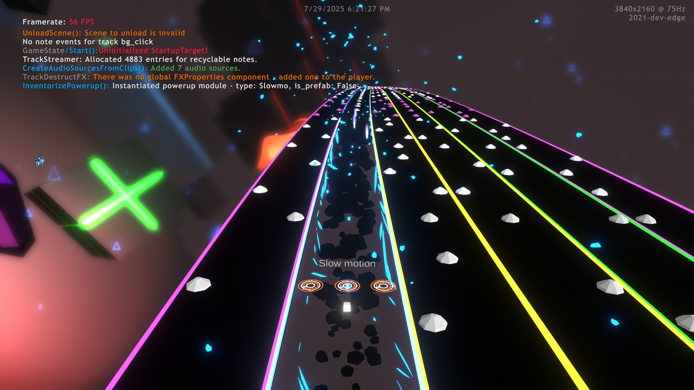
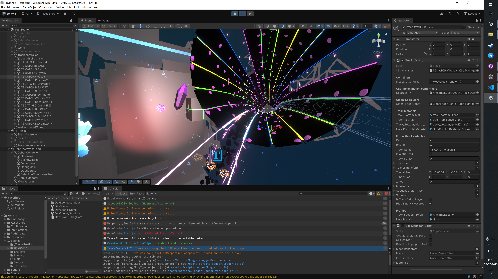
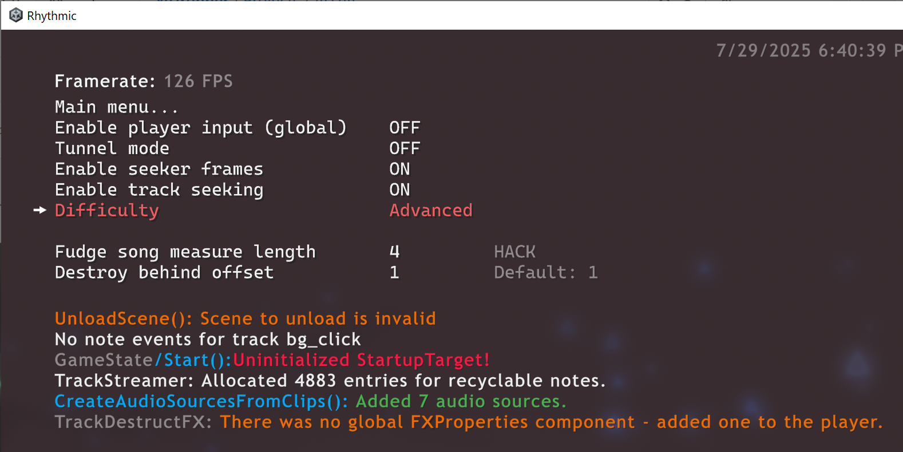
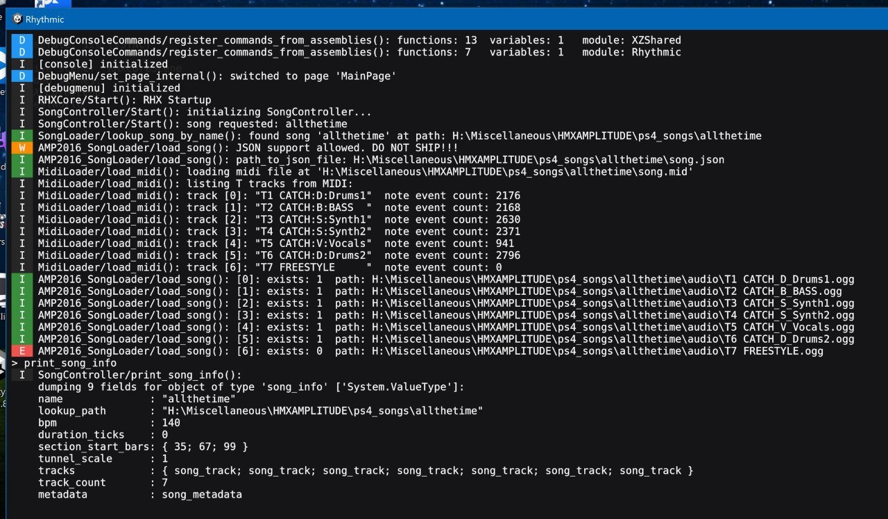
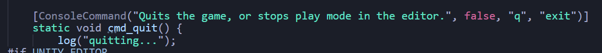

# Rhythmic

Rhythmic is a backward-compatible technical demo re-creating the gameplay flow and mechanics of Amplitude (2016) within the Unity game engine.

[Amplitude](https://www.amplitude-game.com) is a music-driven rhythm game developed by Harmonix Music Systems, available exclusively on PlayStation.

  <!-- YouTube link -->
  <a href="https://youtu.be/DWbndWpg2g4">
  <picture>
  <source media="(prefers-color-scheme: light)" srcset="Assets/YT-light.png">
  <source media="(prefers-color-scheme: dark)"  srcset="Assets/YT-dark.png">
  
  </picture>
  </a>

  <!-- GitHub link -->
  <a href="https://github.com/xezrunner/Rhythmic">
  <picture>
  <source media="(prefers-color-scheme: light)" srcset="Assets/GitHub-light.png">
  <source media="(prefers-color-scheme: dark)"  srcset="Assets/GitHub-dark.png">
  
  </picture>
  </a>

### About the game

Amplitude plays on a highway or tunnel of tracks, with each track being a particular instrument within the song. The goal of the game is to build up and complete the song by hitting notes at the right time, pressing the top buttons on the controller (L1, R1, R2) and by switching tracks using the D-pad or analog sticks.

The [original Amplitude game released in 2003](https://en.wikipedia.org/wiki/Amplitude_(2003_video_game)) on PlayStation 2, with a [reboot releasing in 2016 for PS3 and PS4](https://en.wikipedia.org/wiki/Amplitude_(2016_video_game)).

**This project mainly aims to replicate the 2016 PS4 version** in terms of visuals and user experience, though backward compatibility with the 2003 version's songs is planned.

While Rhythmic is compatible with songs from Amplitude, no proprietary assets from it ship with the project, including songs. These files have to be provided and converted by the user using their legally owned copy of Amplitude.

As it is a technical demo, **the project is not intended to launch on storefronts, nor will it fully replicate the original title's user experience.**

### Development timeline
**2020 Q1:** Project started  
**2021 Q1:** Technically playable status  
**2021 Q2:** Playable technical demo with initial visual polish  
**2021 Q4:** Development paused   **_<-- (screenshots below)_**  
**2023-now:** Ongoing reworks; system structures repurposed and improved externally

### Details

Rhythmic has the ability to use the original Amplitude game's metadata files, along with manually converted songs, to play the original songs in Rhythmic.

A custom song format and editor is planned, but was not finished for the playable demo.

### Systems

As part of this project, some in-game systems were created to help make prototyping and debugging easier. These systems got refactored and reused in future projects.

##### Debug menu and stats

Debug menu pages and menu item entries can be created and registered with a few lines of code. Variables, such as booleans and numbers, are automatically handled and can be adjusted through a keyboard or gamepad.

In later projects, functions that build menus can be marked with an attribute, which get dynamically registered automatically on startup, making them easier to create and use.

##### Debug console

A slide-down Quake-style debug console was created to facilitate console commands that can be invoked during gameplay.

The newest version of the debug console queries and registers commands dynamically during runtime by finding C# functions, variables and properties marked for console use.

Just like the debug menu, the console also has support for recognizing basic types for manipulation, like enums and numbers.

