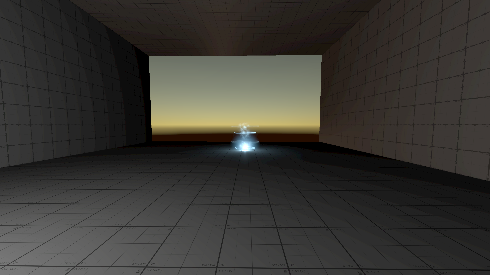
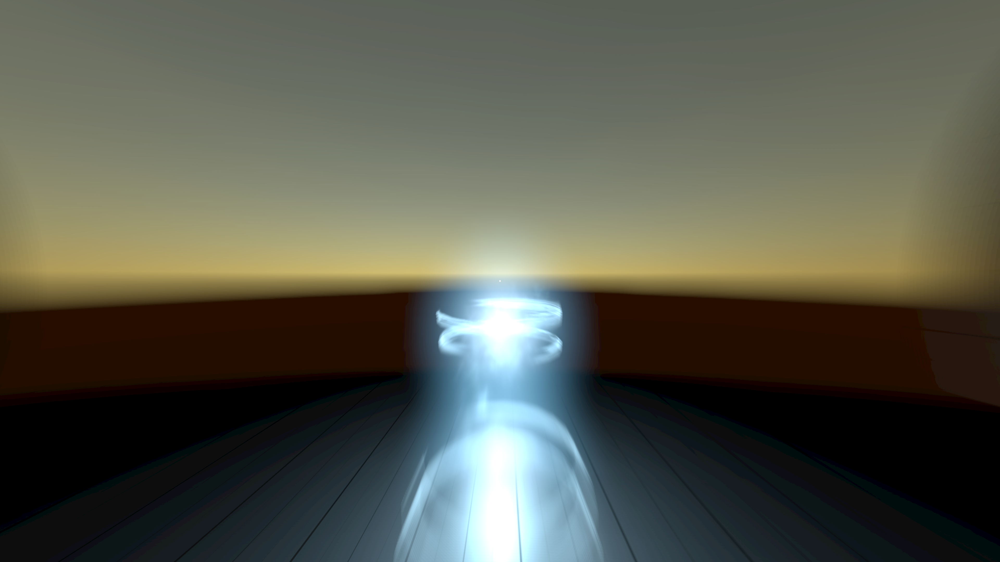
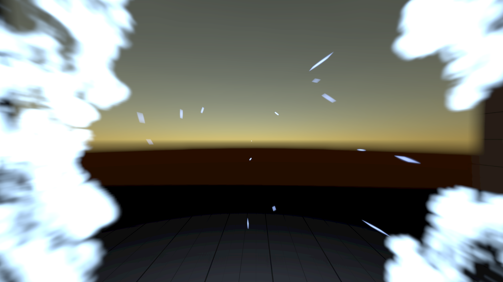

# Re-creation of video game abilities

### ⚠ Work in progress [`TestProject000`](https://github.com/xezrunner/TestProject000)

This project aims to recreate certain video game abilities in the Unity game engine.

### Dishonored: Corvo's Blink

  <!-- YouTube link -->
  <a href="https://youtu.be/GYkfepLYDU4">
  <picture>
  <source media="(prefers-color-scheme: light)" srcset="Assets/YT-light.png">
  <source media="(prefers-color-scheme: dark)"  srcset="Assets/YT-dark.png">
  
  </picture>
  </a>

  <!-- GitHub link -->
  <a href="https://github.com/xezrunner/TestProject000">
  <picture>
  <source media="(prefers-color-scheme: light)" srcset="Assets/GitHub-light.png">
  <source media="(prefers-color-scheme: dark)"  srcset="Assets/GitHub-dark.png">
  
  </picture>
  </a>

  
  
  

