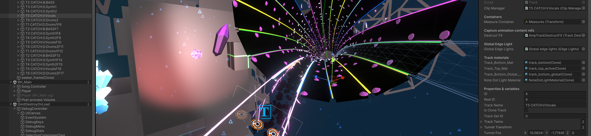
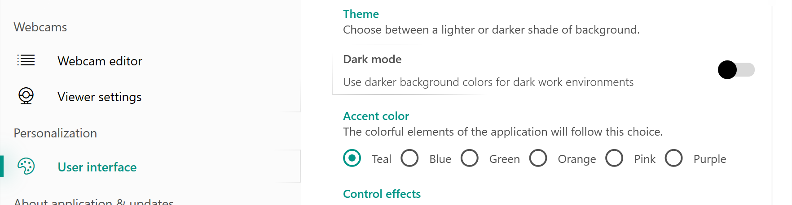
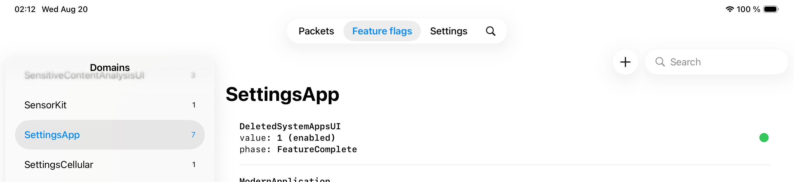
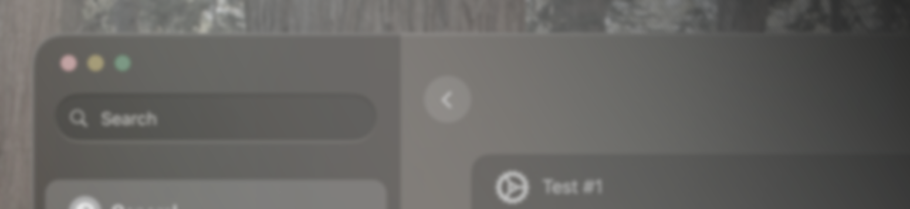
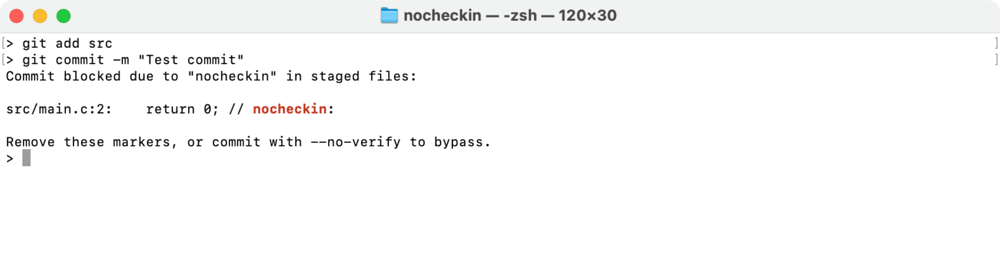

Software developer and enthusiast, with interests in:

- Developing parts of projects involving:
  - user interface & experience (visual layout and design, smooth animations & interactions)
  - game systems & mechanics, VFX
  - debug features, tooling
- Experimental tools
- General software optimization
- Reverse engineering
- Visual effects and motion graphics

<b>What I work in/with:</b> <i>(click to open/close)</i>

### Languages and frameworks (by frequency):
- **Swift/SwiftUI**
- **C# (Unity, XAML: WPF/WinUI)**
- C/C++/Objective-C
- Java

### Software:

- Source control: Git
- Code editors:
  - Visual Studio & Visual Studio Code
  - Xcode
  - JetBrains IntelliJ IDEA
- Creative tools:
  - Unity Engine (+ _Blender_)
  - Adobe After Effects
  - Figma
  - LottieLab

## My work

<b>Highlights</b>

### [Rhythmic](https://github.com/xezrunner/xezrunner/blob/main/Projects/Rhythmic.md)

A work-in-progress compatible reimplementation of Amplitude in the Unity game engine

### [XeZrunner.UI](https://github.com/xezrunner/xezrunner/blob/main/Projects/WebcamViewerX.md)

A custom UI library for WPF, replicating and combining Microsoft's Fluent Design and Google's Material Design.

<a href="https://github.com/xezrunner/xezrunner/blob/main/Projects/WebcamViewerX.md">
<picture>
  <source media="(prefers-color-scheme: light)" srcset="Assets/XesignUI-hero-light.png">
  <source media="(prefers-color-scheme: dark)"  srcset="Assets/XesignUI-hero-dark.png">
  
</picture>
</a>

<!-- 
### [InternalInspect](https://github.com/xezrunner/InternalInspect)

A tool that allows querying system functions and controlling feature flags on Apple platforms

<a href="https://github.com/xezrunner/InternalInspect">
<picture>
  <source media="(prefers-color-scheme: light)" srcset="Assets/InternalInspect-hero-light.png">
  <source media="(prefers-color-scheme: dark)"  srcset="Assets/InternalInspect-hero-dark.png">
  
</picture>
</a>
-->

### Coming soon...

<a href="Assets/SWmac-hero-wip.png">
<picture>
  <source media="(prefers-color-scheme: light)" srcset="Assets/SWmac-hero-wip-2.png">
  <source media="(prefers-color-scheme: dark)"  srcset="Assets/SWmac-hero-wip.png">
  
</picture>
</a>

### [-> <u>Browse all projects...</u>](https://github.com/xezrunner/xezrunner/tree/main/Projects)

<b>Smaller projects</b>

### [Git `nocheckin` pre-commit hook](https://gist.github.com/xezrunner/e6dbafcc21fcbc976c93bdee0f371a08)

A pre-commit hook for Git that rejects commiting staged files containing a special keyword (`nocheckin`)

<a href="https://gist.github.com/xezrunner/e6dbafcc21fcbc976c93bdee0f371a08">
<picture>
  <source media="(prefers-color-scheme: light)" srcset="Assets/nocheckin-hero-light.png">
  <source media="(prefers-color-scheme: dark)"  srcset="Assets/nocheckin-hero-dark.png">
  
</picture>
</a>

